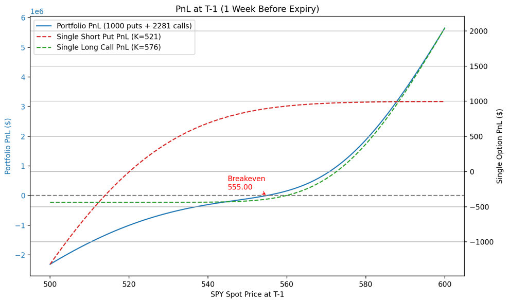
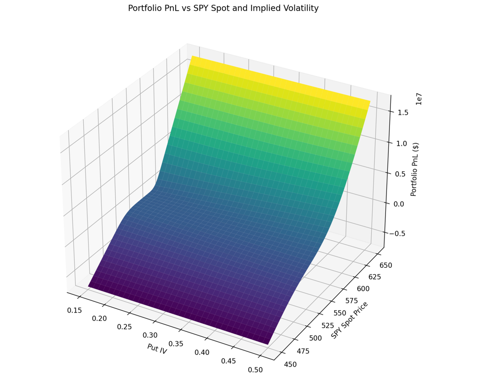
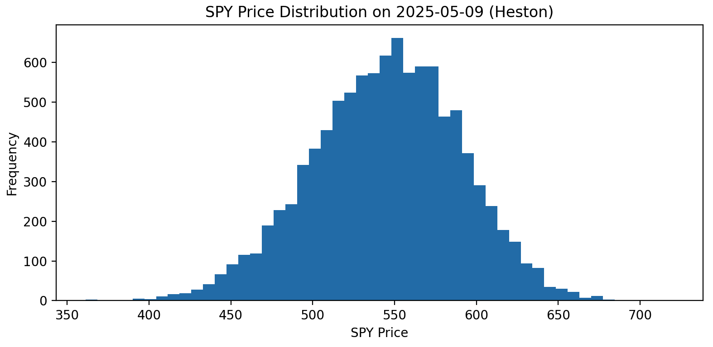
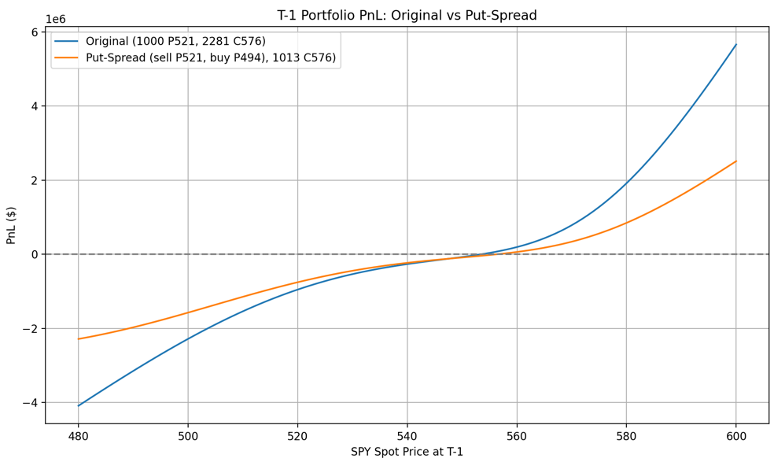

# SPY Option Project

Guangda Fei, Apr 20, 2025 

<h2>data</h2>

### File1: data/dataset_guangda_fei.xlsx
 📊 Sheet 1: Option Chain
 &emsp;Option Chain data at Date 04/09/2025
 
📊 Sheet 2: IV
 dates: 2023/1/3 - 2025/4/9
 columns:  &emsp;SPY Close, ATM Vol 1m, 95% Moneyness Vol 1m, 105% Moneyness Vol 1m

### File2: data/SOFR.xlsx
dates: 2025/03/13 - 2025/04/16
  I will only use the 2025/04/09 SOFR

<h2>Part 1: Scenario Analysis Template</h2>

### a) Build equity option valuation model
File: 1a)black_scholes.py

Market Prices: Option Chain data on 04/09/2025
 Put (K=521) Price: $11.02
 Call (K=521) Price: $40.97

Put (K=576) Price: $28.88
 Call (K=576) Price: $4.08

I use Black-Scholes model for the following Option Pricing. 

### b) scenario analysis
Calculate the PnL of the trade structure, as of 1 week prior to expiry, for each
scenario

#### - Graph: PnL vs. SPY Spot Prices on 05/09/2025
File: 1b)Graph.py

Assumption: IVs fixed, SOFR as interest rate

 Put Position: 1000
 Call Position: 2281
 Cash position: 203 (ignore its return)

Greeks on 04/09/2025:

| Greek  | Value($)  |
|--------|-----------|
| Delta  | 80,580    |
| Gamma  | 1,623     |
| Vega   | 6,166,632 |
| Theta  | -1,358,082|
| Rho    | 1,128,685 |

 

#### - Technical: Scenario Analysis
File: 1b)Scenario_Analysis.py

Assumption:
  SOFR as interest rate
  95% IV - 105% IV = 8% (Further investigation below)

Grid of different spot prices and IVs on 2025/05/09

From this graph we can see that the change in Pnl is more dependent on the price changes of 
Spot prices at T-1 instead of the volatility.

#### - Fundamental Analysis: tariff, economic factors (comments only)
The first quesiton is whether the prices of SPY will increase? 
The answer of this question is heavily based on the current policy about 
the US and the global economics. 

When looking at the historical IVs, the current IVs are definately much higher 
than usual. Therefore, the second key questions is whether the market will become 
more stable after one month and in what percentage? 

Even though I believe eventually everything will be back to normal, 
it is hard to tell when. But I think one month is too short for the 
market to be stabilized (High IV). 

<h2>Part 2: Trade Decision and Structure </h2>

### a) Historical Data Analysis
I initially modeled SPY with GBM for simplicity and closed-form pricing. 
But GBM doesn't capture SPY’s volatility clustering, skew, or jump behavior. 
For more robust modeling, I'd switch to a Heston model. 
On the IV side, I'd fit the surface using SABR to capture skew and ensure no arbitrage.

Assumptions: 
  1) SOFR as interest rate
  2) Other factors stay the same (we are considering this problem without Economical 
and political factors)

#### - Heston for SPY
File: 2a)Heston_calibration.py, 2a)SPY_Heston.py

Use data on 04/09/2025 to determine the parameters 
(can expand the residual function to include more data points):

| Parameter |    Value   |
|-----------|-----------:|
| kappa     |    1.5 |
| theta     |    0.060282|
| sigma_v   |    0.3  |
| rho       |   -0.7  |
| v0        |    0.060282|

| Statistic   | SPY Price  |
|-------------|-----------:|
| Median      | 546.64 |
| 5th%ile    | 467.73|
| 95th%ile   | 617.34 |

 

#### - SABR for IV
File: 2a)IV_SABR.py

β = 0.5
 α,ρ,ν are derived using the Least Square method with data on 04/09/2025 
(can expand the residual function to include more data points)

| Strike | Predicted IV on 2025‑05‑09 |
|-------:|---------------------------:|
| 521.00 |                     0.3173 |
| 548.62 |                     0.2235 |
| 576.00 |                     0.1752 |

 

#### - Predicted Return:
File: 2b)Portfolio_Returns_Calculation.py

Assumption: initial capital is the cash we get from selling the put.

| Metric                |        Value |
|-----------------------:|-------------:|
| Put Value ($)         |         1.82 |
| Call Value ($)        |        0.06 |
| Portfolio Value ($)   |  -168963.52 |
|  Portfolio Return   |  -0.169 |

### b) Reasonable Max Loss/Gain:
File: 2b)Portfolio_Returns_Calculation.py

Here I will use the 95% and 5% predicted prices from the Heston Model of SPY.
And IVs are the prediction from SABR Model.

Max Gain: 
SPY(95%): 606.27

| Metric                 |       Value |
|------------------------:|------------:|
| Put Value ($)          |   0.00 |
| Call Value ($)         |      41.84 |
| Portfolio Value ($)    |   9,542,782 |
| Portfolio Return       |       9.571497 |

Max Loss: (95% VaR)
SPY(5): 479.98

| Metric               |                       Value |
|----------------------:|----------------------------:|
| Put Value ($)        |                    52.88 |
| Call Value ($)       | 0.00   |
| Portfolio Value ($)  |               -5,288,157    |
| Portfolio Return     |                    -5.304069 |

### Conclusion:
We should not do the trade as its predicted return is not desirable. 

<h2>Part 3: Other Trade Structures </h2>

### a) Buying a further OTM put
File: 3a)PutSpread_Graph.py

Assumption: SOFR as r, Volatility Fixed

Buying a further OTM put controls the downside risks therefore is 
better compare to the trade above.

Let's use 90% moneyness Put:
SPY US 05/16/25 P494 Equity: 5.54

From the graph we can see that they have similar PnL structure, but 
the new portfolio has smaller risk and return due to less initial capital from 
the spread. The new breakeven point is greater 
than the original portfolio whereas the predict SPY is below curernt values. Therefore 
this new portfolio is still not desirable. 

### b) Buying SPY outright
Delta = 1
  Vega = 0
  Gamma = 0
 Buy SPY outright means both upside and downside return/risk is not controlled.
 Which is very different from the portfolios above. 

Major Appropriate Situations:
 1) Strong, and Sustained Bull
 2) No drastic volatility changes

which are not the current situation where there are lots of uncertainty in the market. 

<h2>Part 4: Further Improvements </h2>

1. Add Interest Rate Model
2. More robust model parameter calibration: more historical data and train model with periods that have similar situation
3. More detailed report about the models: backtest, calibration quality, and more advanced model
4. Consider macro factors

